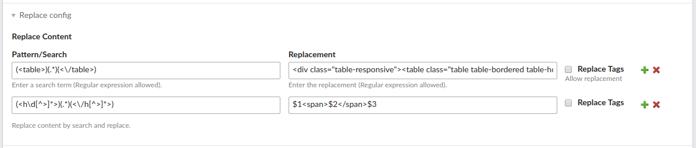

# Contao Replace Bundle

Helper contao bundle to perform a regular expression search and replace on front end page.

## Configuration

Currently it is only possible to search and replace globally. Open your contao settings and configure custom search and replace patterns.

## Examples

### Wrap headline text in ``

Before: `<h1>Test A</h1>` 
After: `<h1>Test A</h1>`

- Pattern: `(<h\d[^>]*>)(.*)(<\/h[^>]*>)`
- Replacement: `$1$2$3`

### Bootstrap 4 responsive tables

Before: `<table><thead><tr><th>Value</th></tr></thead><tbody><tr><td>1</td></tr></tbody></table></body></html>` 
After: `
<table class="table table-bordered table-hover"><thead><tr><th>Value</th></tr></thead><tbody><tr><td>1</td></tr></tbody></table>
`

- Pattern: `(<table>)(.*)(<\/table>)`
- Replacement: `
<table class="table table-bordered table-hover">$2</table>
`

### Replace files path inside links

Before: `<a href="tl_files/subfolder/files/file.pdf">Test link</a>` 
After: `<a href="files/backup/file.pdf">Test link</a>`

- Pattern: `(tl_files\/subfolder\/files\/)`
- Replacement: `
<table class="table table-bordered table-hover">$2</table>
`
- Replace tags: true (checked)